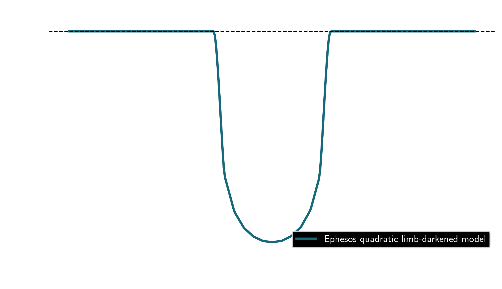

# Ephesos

## Scientific purpose
Ephesos is a light-curve forward-modeling framework for planetary and stellar systems. It computes the relative flux signal from a geometric and brightness model of a system and is intended for transparent model evaluation and diagnostic visualization.

The core scientific workflow is built around evaluating the sky-projected brightness distribution of bodies in a system via the `ephesos.eval_modl()` entry point, enabling investigations of transits, star spots, occultations, phase curves, eclipse mapping, microlensing, and reflected light.

## Repository role in the ecosystem
Ephesos is a scientific modeling library within the wider astrophysical analysis stack. It complements the time-domain and cataloging workflows by making the forward model explicit and inspectable, so researchers can trace how physical assumptions move into the final light curve.

## Installation

```bash
cd /path/to/ephesos
pip install -e .
export EPHESOS_PATH=/path/to/ephesos
```

`EPHESOS_PATH` identifies the repository root. Runtime inputs belong under `data/` and generated pipeline outputs belong under `visuals/`. Both directories are ignored by Git.

## Minimal usage

The runnable example evaluates a central transit with a three-day orbital period, a companion-to-star radius ratio of 0.1, a summed-radius-to-semimajor-axis ratio of 0.1, and quadratic limb darkening:

```bash
python examples/minimal_transit.py --typefileplot png
```



The curve is a deterministic forward-model prediction under the stated assumptions. It contains no observed or randomly generated data. The example calls `ephesos.eval_modl()` directly and produces a 1.13% limb-darkened transit, exposing the input geometry and resulting relative flux in one inspectable calculation.

## Model diagnostics
A useful forward-model run should make the following visible:

- the input system geometry and stellar properties;
- the intermediate brightness model or limb-darkening assumptions;
- the resulting relative flux light curve;
- any residuals or model comparison diagnostics.

This makes the scientific assumptions inspectable without having to reverse-engineer the source code.

## Current maintenance status
Ephesos remains a research-grade scientific library rather than a broad generic astronomy toolkit. The supported package surface is the importable model and evaluation functions, while legacy analysis scripts and notebooks are kept as historical or exploratory material unless they are explicitly migrated into the active API.

