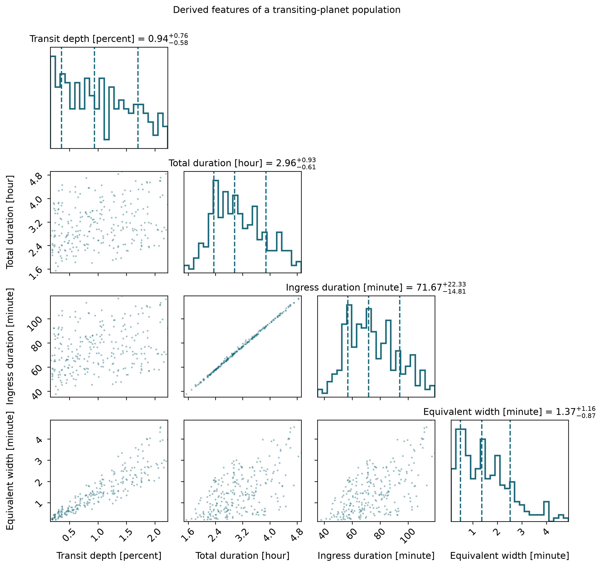
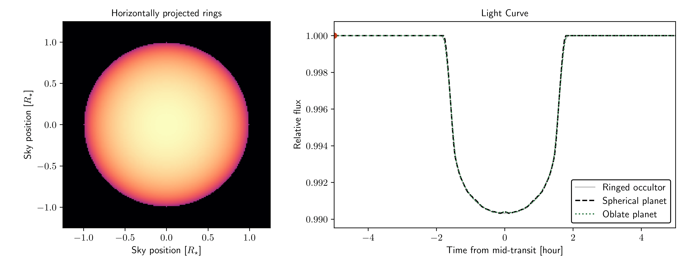
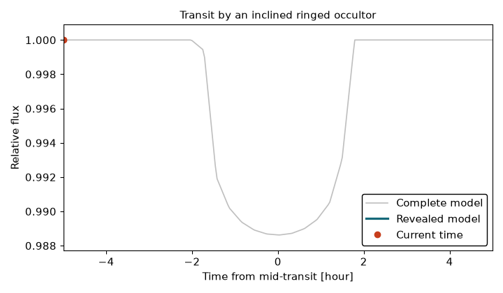

# Ephesos

## Scientific purpose
Ephesos is a light-curve forward-modeling framework for planetary and stellar
systems. It computes relative flux from explicit geometry and brightness models.

The core workflow evaluates sky-projected brightness through `ephesos.eval_modl()`.
The concise `ephesos.evaluate_transit_model()` interface covers deterministic
single-companion transit calculations.

## Repository role in the ecosystem
Ephesos is a scientific modeling library within the astrophysical analysis stack.
It exposes how physical assumptions determine a modeled light curve.

## Installation

```bash
cd /path/to/ephesos
pip install -e .
export EPHESOS_PATH=/path/to/ephesos
```

`EPHESOS_PATH` identifies the repository root. Runtime inputs belong under `data/`.
Generated pipeline outputs belong under `visuals/`. Git ignores both directories.

## Minimal usage

The runnable example evaluates a central transit with a three-day orbital period,
a companion-to-star radius ratio of 0.1, a summed-radius-to-semimajor-axis ratio
of 0.1, and quadratic limb darkening.

```bash
python examples/minimal_transit.py --typefileplot png
```


The curve is a deterministic prediction under these assumptions. It contains no
observed or randomly generated data. The model produces a 1.13% transit depth.

Maintained single-system examples write compact GIFs without external data or
command-line animation tools. The population example writes a static corner plot
of features derived from the synthesized light curves.

```bash
python examples/minimal_transit.py
python examples/arbitrary_occultor.py
python examples/run_WhiteDwarf.py
python examples/run_WASP43.py
python examples/run_population.py
```

Single-system animations are written beside their scripts. The population summary
is written to `examples/population_features.png` and shows transit depth, total
duration, ingress duration, and equivalent width for 256 deterministic systems.



The ringed-occultor workflow generates face-on, horizontally projected, and
vertically projected ring examples. Each animation compares the ringed model
with spherical and oblate planets on the same orbit. Every shape has the same
projected occulting area, isolating light-curve differences caused by shape.






## Reusable plotting

`ephesos.save_light_curve_figure()` writes `png` output at 300 dots per inch or
vector `pdf` output. It uses a white background by default and accepts
`typeplotback="dark"`. `ephesos.save_light_curve_animation()` applies the same
labels, colors, typography, and opaque legend to GIF output.

## Model diagnostics
A useful forward-model run should make the following visible:

- the input system geometry and stellar properties
- the intermediate brightness model or limb-darkening assumptions
- the resulting relative flux light curve
- any residuals or model comparison diagnostics

This makes the scientific assumptions directly inspectable.

## Current maintenance status
Ephesos remains a focused research-grade scientific library. Its supported surface
consists of importable model, evaluation, and visualization functions. Regression
tests cover legacy internals while maintained workflows move into package functions.

