# Ephesos

## Purpose
Ephesos is a light-curve forward-modeling framework for planetary and stellar
systems. It computes relative flux from explicit geometry and brightness models.

The core workflow evaluates sky-projected brightness through `ephesos.eval_modl()`.
The concise `ephesos.evaluate_transit_model()` interface covers deterministic
single-companion transit calculations.

## Light-curve modeling
Ephesos predicts light curves from explicit orbital geometry, companion
sizes, surface-brightness profiles, and limb-darkening assumptions.

## Installation

```bash
cd /path/to/ephesos
pip install -e .
export EPHESOS_PATH=/path/to/ephesos
```

`EPHESOS_PATH` identifies the repository root. Runtime inputs belong under `data/`.
Generated pipeline outputs belong under `visuals/`. Git ignores both directories.

## Minimal usage

The runnable example evaluates a central transit with a three-day orbital period,
a companion-to-star radius ratio of 0.1, a summed-radius-to-semimajor-axis ratio
of 0.1, and quadratic limb darkening.

```bash
python examples/minimal_transit/minimal_transit.py --typefileplot png
```

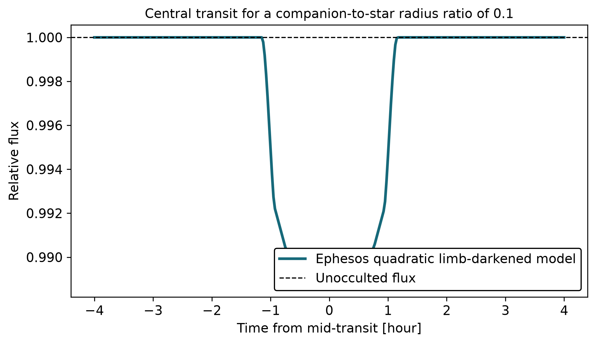

The curve is a deterministic prediction under these assumptions. It contains no
observed or randomly generated data. The model produces a 1.13% transit depth.

Maintained single-system examples write compact GIFs without external data or
command-line animation tools. The population example writes a static corner plot
of features derived from the synthesized light curves.

```bash
python examples/minimal_transit/minimal_transit.py
python examples/PlanetsWithDisks/PlanetsWithDisks.py
python examples/arbitrary_occultor/arbitrary_occultor.py
python examples/astromusers_logo_occultor/astromusers_logo_occultor.py
python examples/compact_multiplanet/compact_multiplanet.py
python examples/known_self_lensers/known_self_lensers.py
python examples/run_WhiteDwarf/run_WhiteDwarf.py
python examples/run_WASP43/run_WASP43.py
python examples/run_population/run_population.py
python examples/self_lensing/self_lensing.py
python examples/transits_simultaneous/transits_simultaneous.py
```

Single-system animations are written beside their scripts. The population summary
is written to `examples/run_population/population_features.png` and shows transit
depth, total duration, ingress duration, and equivalent width for 2,048 deterministic
oblate and ringed systems. It also shows each feature's departure from a matched
spherical planet with the same projected occulting area and orbit.

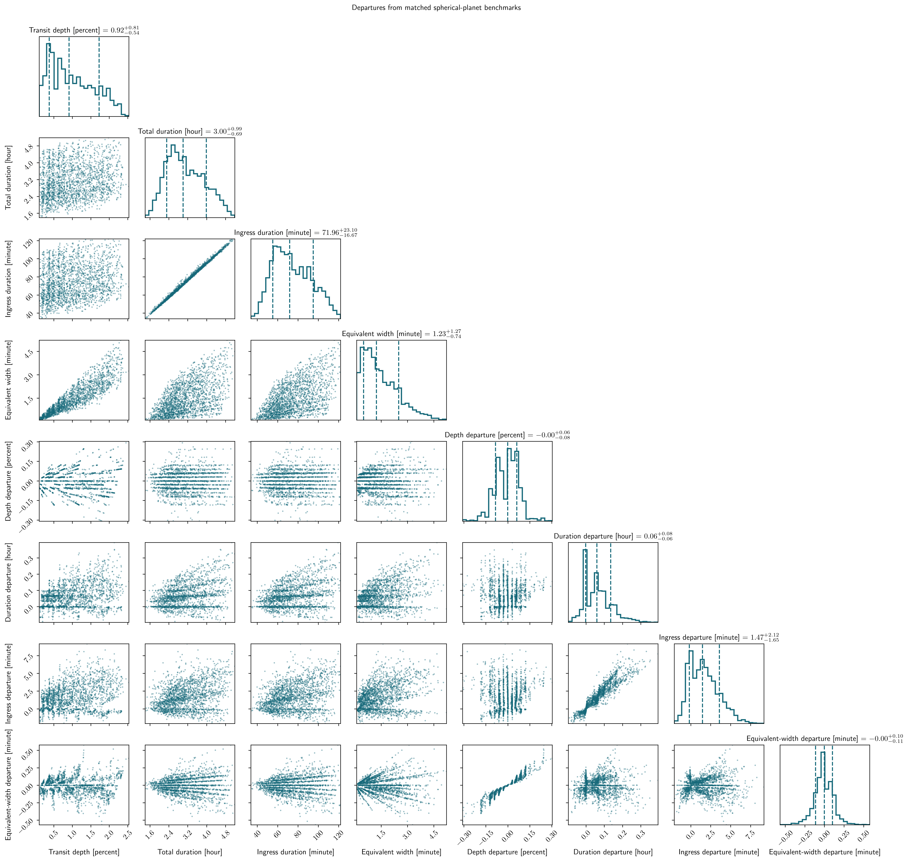

The ringed-occultor workflow generates face-on, horizontally projected, and
vertically projected ring examples. Each animation compares the ringed model
with spherical and oblate planets on the same orbit. Every shape has the same
projected occulting area, isolating light-curve differences caused by shape.

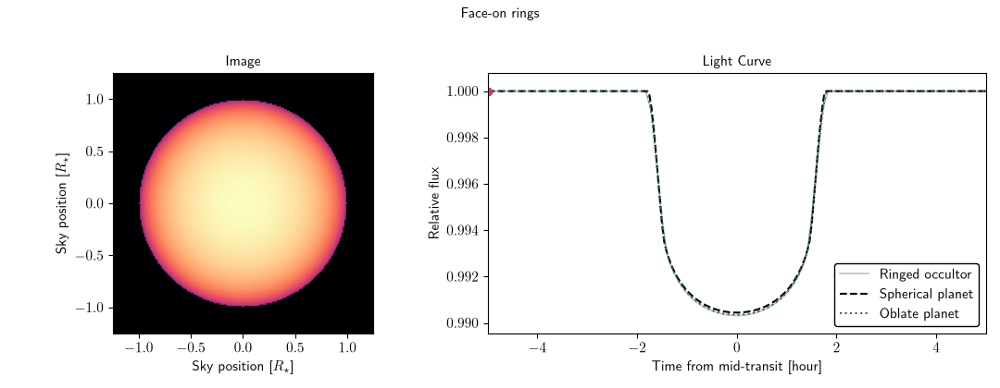

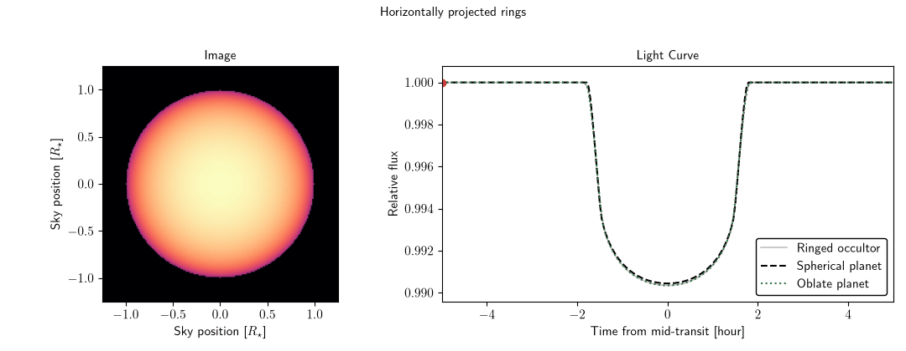


The AstroMusers example uses the complete group logo as the transiter and compares
its light curve with the logo's central circular component on the same orbit.

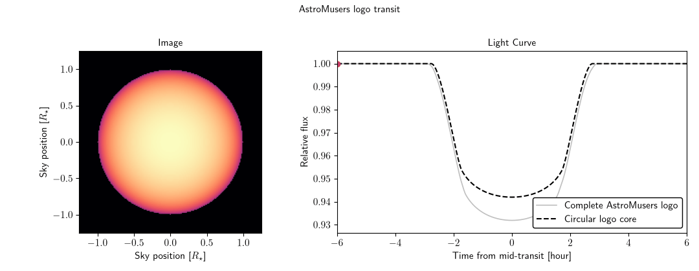

The self-lensing example compares deterministic 30-day binaries containing
$0.6\,M_\odot$ white-dwarf, $1.4\,M_\odot$ neutron-star, and $8\,M_\odot$
black-hole companions orbiting a solar analog. A controlled white-dwarf
comparison isolates the effects of quadratic limb darkening and projected
impact parameter. These are explicit toy systems rather than fits to observed
data.

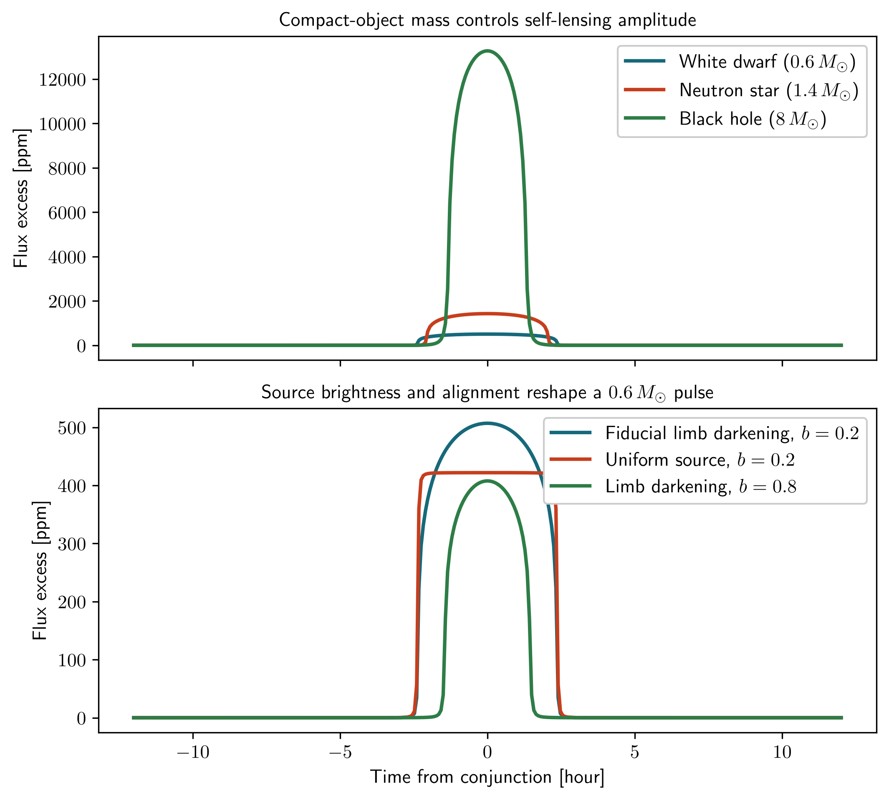

The known-self-lenser example compares Ephesos predictions with public Kepler
observations of KOI-3278 and KIC 8145411. The bundled compact tables contain
author-reduced simple-aperture photometry from Kruse and Agol (2014) for
KOI-3278 and quality-filtered Pre-search Data Conditioning photometry from the
Mikulski Archive for Space Telescopes for KIC 8145411. The latter uses the pulse
ephemeris and system parameters reported by Masuda et al. (2019). The Ephesos
curves use the published masses, radii, periods, and impact parameters without
fitting the plotted data.

The current Ephesos self-lensing interface assumes circular motion and omits
finite-lens occultation, third-light dilution, and Kepler cadence integration.
Its curves are therefore local finite-source approximations rather than
reproductions of the papers' eccentric-orbit fits. The data files retain source
and reduction metadata. Run `prepare_data.py` in the example directory to
reproduce them from the public sources when network access is available.

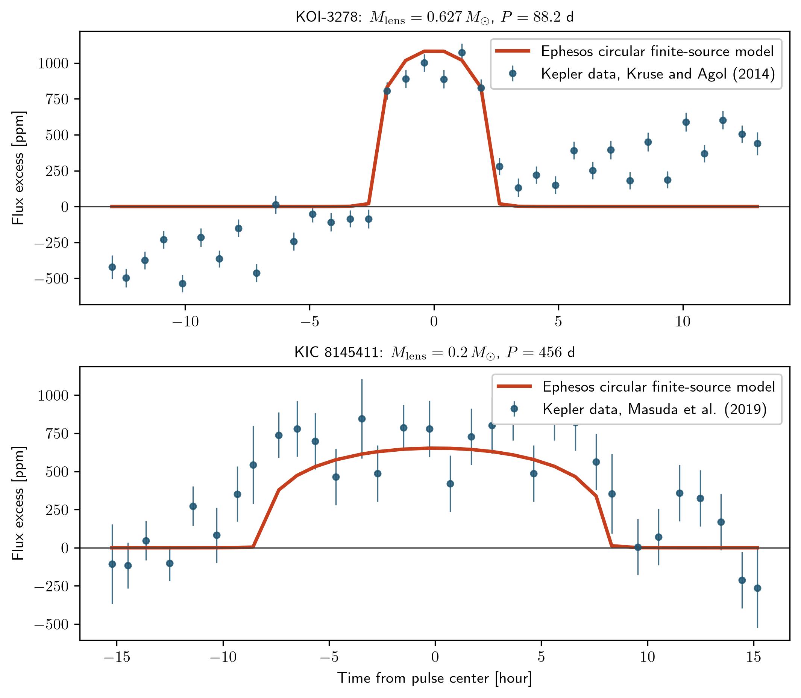

The circumplanetary-disk example compares face-on and edge-on disk silhouettes
with a spherical planet of equal projected occulting area. Its lower panel shows
the shape-induced departure from that spherical benchmark in parts per thousand.

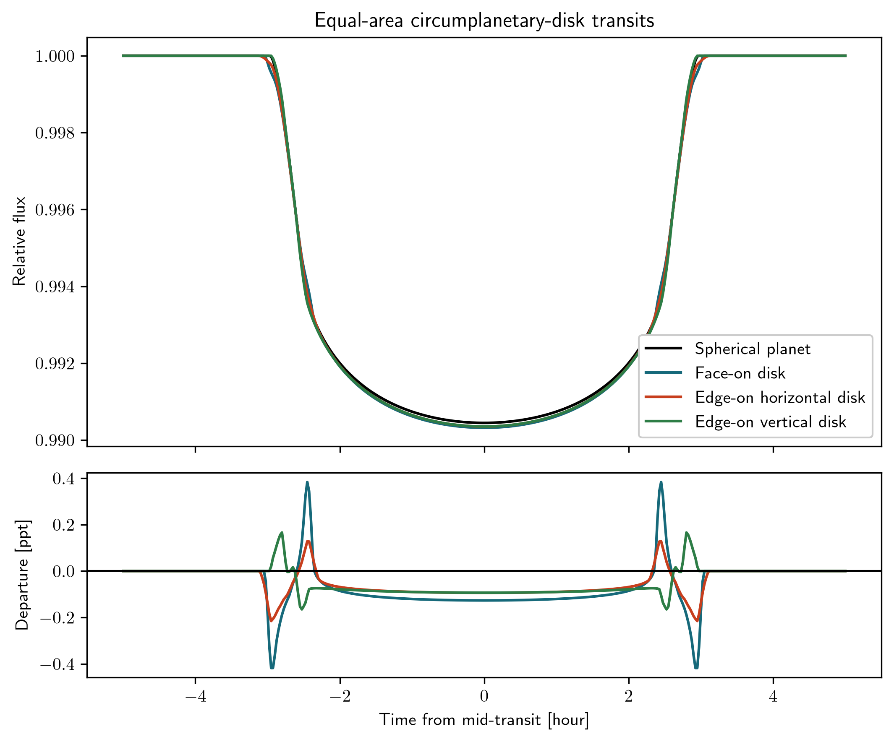

The simultaneous-transit example places two planets in an illustrative 3:2
resonant pair with a shared mid-transit time. The animation compares their
combined light curve with each planet's isolated contribution.

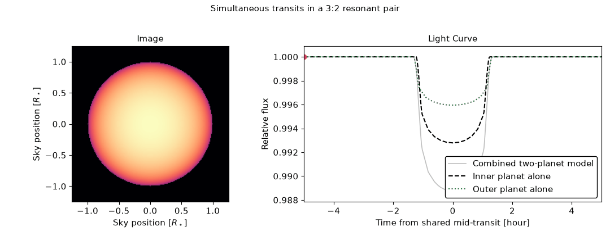

The compact-system example synthesizes an illustrative seven-planet
TRAPPIST-1-like resonant chain rather than fitting observations. It produces 21
transit events over 12 days. Its minimum adjacent separation is 6.54 mutual Hill
radii, exceeding the circular coplanar pairwise threshold of 3.46.

The reveal variant preserves the complete green light-curve history.

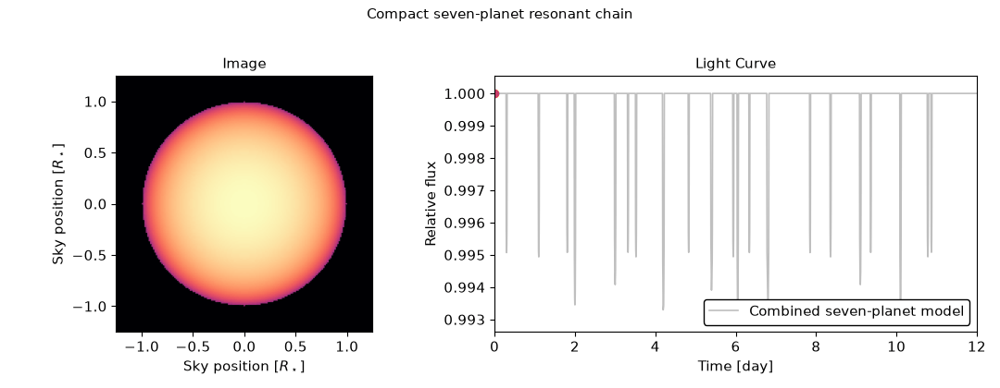

The trailing variant keeps only the latest three transit durations green.
Its playback slows by factors of 2 during full transits, 4 during ingress and
egress, and 6 during simultaneous transits.

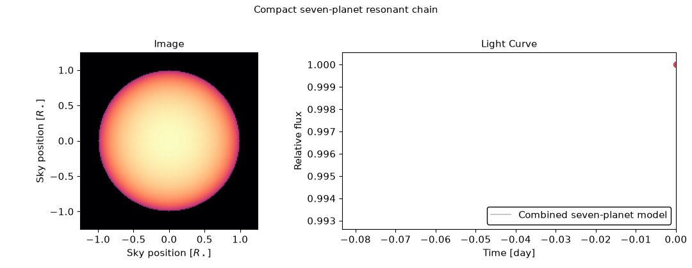

## Reusable plotting

`ephesos.save_light_curve_figure()` writes `png` output at 300 dots per inch or
vector `pdf` output. It uses a white background by default and accepts
`typeplotback="dark"`. `ephesos.save_light_curve_animation()` applies the same
labels, colors, typography, and opaque legend to GIF output. Its default
`light_curve_mode="reveal"` retains the complete green history. The alternative
`light_curve_mode="trailing"` shows a moving recent-history window over the gray
curve. That window defaults to three measured transit durations and can be set
explicitly with `history_duration` in the time-axis units.

## Model diagnostics
A useful forward-model run should make the following visible:

- the input system geometry and stellar properties
- the intermediate brightness model or limb-darkening assumptions
- the resulting relative flux light curve
- any residuals or model comparison diagnostics

This makes the scientific assumptions directly inspectable.

